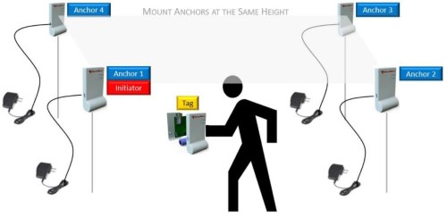
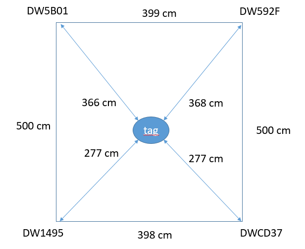

# Position estimation from Decawave DWM1001 distance measurements

This tutorial shows how the position of a tag can be estimated from the raw distance measurements made by Decawave MDEK1001 development kit.

Decawave MDEK1001 is a development kit for indoor positioning application utilizing ultra-wideband (UWB) radio technology. UWB enables the accurate measure of the time of flight of the radio signal, leading to centimeter accuracy in the range measurement and positioning. 

If you have a Decawave MDEK1001 development kit, you can set up the system and collect data from Decawave modules by yourself. Otherwise, you can start from sample data of this page, and test the algorithm to be developed with that data.

The first chapters contain instructions how to setup the DWM1001 system and how to collect the raw distance data from the system. You can skip these chapters, if you want to use existing sample data instead, and start from the chapter [Sample test data](#sample-test-data).

Instructions for position estimation algorithms are given in chapter [Position estimation](#position-estimation). The position is calculated in 2D using least-squares solution.

## DWM1001 Development Kit

MDEK1001 development kit contains 12 encased development boards (DWM1001-DEV) and necessary software for system setup, networking and positioning. Each DWM1001-DEV module can be configured as an anchor or a tag. DWM1001-DEV modules use Bluetooth for communication and UWB for ranging. More information about MDEK1001 Development Kit can be found [here](https://www.decawave.com/product/mdek1001-deployment-kit/)

The figure below shows an DWM1001-DEV module.


The system contains also Android application, which can be used for module configuration and positioning. Alternatively, the module configuration can be done by using the UART shell mode.

## System setup with Android application

Document [MDEK1001 Quick Start Guide](https://www.decawave.com/mdek1001/quickstart/) contains the instructions to set up the system quickly by using Android application. Four DWM1001-DEV modules are used as anchors and one module is used as a tag, which position will be estimated. 



After configuring the anchors and tags, the coordinates of anchors can be determined automatically by using Android application's Auto-Positioning function. However, it is recommended to measure the anchor coordinates manually with one cm accuracy or better.

After the configuration phase, the Android application is ready for estimating the position of the tag. 

## System setup using the UART shell mode

MDEV1001 module firmware contains an APIs to to create a network and configure the nodes directly over UART. Instructions for that are found from DWM1001 Gateway Quick Deployment Guide, which can be found [here](https://www.decawave.com/product/mdek1001-deployment-kit/). (Download "DWM1001, DW10001-DEV and MDEK1001 Documents, Source Code, Android Application & Firmware Image" zip package at the end of page.)

Connect the DWM1001-DEV to the PC over USB and launch a telnet client (for example TeraTerm or PuTTY). Set the baud rate as 115200. In the telnet client shell press `Enter` twice in order to start DWM1001 UART shell mode.

Each DWM1001-DEV module is configured either as Initiator, Anchor or Tag. 

- Anchor is used as reference to calculate tag position with trilateration. Position coordinates of the anchors are known.
- Initiator is an anchor, which will initialize the network. A network must contain at least one initiator.
- Tag is a mobile node whose position will be estimated.

All of the initiators, anchors and tags must have a common network ID (PAN ID).

Configure one module as an **Initiator** by following commands:

- `nis 0x1234`: set up the node PAN ID to 0x1234
- `aps 0 0 0`: set up the node coordinates to x = 0, y = 0, z = 0. Coordinates are given as millimeters.
- `nmi`: configure the node as initiator (and anchor) and reset the device. The UART shell mode is re-entered by sending `Enter` twice.

The node status is obtained by command `si`.

Configure three modules as **Anchors** by following commands:

- `nis 0x1234`: set up the node PAN ID to 0x1234
- `aps 1000 2000 0`: set up the node coordinates to x = 1 m, y = 2 m, z = 0. Coordinates are given as millimeters.
- `nma`: configure the node as anchor and reset the device.

Configure one module as a **Tag** by following commands:

- `nis 0x1234`: set up the node PAN ID to 0x1234
- `nmt`: configure the node as tag and reset the device.

## Collecting data using UART shell mode

The raw range measurements and position estimated by the Decawave system can be obtained with the UART shell mode. 

Connect the **tag module** to the PC over USB and launch a telnet client. In the telnet client shell press `Enter` twice in order to start DWM1001 UART shell mode. Send the `les` command to tag.

The tag starts to send raw range and position data to the telnet client window:

```python
dwm> les
CD37[0.00,0.00,0.00]=2.80 1495[0.00,3.99,0.00]=2.74 592F[5.00,0.00,0.00]=3.60 5B01[5.00,3.99,0.00]=3.70 le_us=3387 est[1.90,1.96,0.15,91]
CD37[0.00,0.00,0.00]=2.76 1495[0.00,3.99,0.00]=2.75 592F[5.00,0.00,0.00]=3.61 5B01[5.00,3.99,0.00]=3.73
...
```

Collect some data and save the data to a text file for further analysis.

## Sample test data

File [decawavedatafloor.txt](example/decawavedatafloor.txt) contains sample raw range and position data. One line contains the range measurements from the tag to each anchor, anchor coordinates and the estimated position.

```python
CD37[0.00,0.00,0.00]=2.80 1495[0.00,3.99,0.00]=2.74 592F[5.00,0.00,0.00]=3.60 5B01[5.00,3.99,0.00]=3.70 le_us=3387 est[1.90,1.96,0.15,91]
CD37[0.00,0.00,0.00]=2.76 1495[0.00,3.99,0.00]=2.75 592F[5.00,0.00,0.00]=3.61 5B01[5.00,3.99,0.00]=3.73 le_us=3387 est[1.90,1.94,0.24,90]
CD37[0.00,0.00,0.00]=2.79 1495[0.00,3.99,0.00]=2.74 592F[5.00,0.00,0.00]=3.75 5B01[5.00,3.99,0.00]=3.65 le_us=3387 est[1.89,1.98,0.36,85]
CD37[0.00,0.00,0.00]=2.78 1495[0.00,3.99,0.00]=2.74 592F[5.00,0.00,0.00]=3.61 5B01[5.00,3.99,0.00]=3.65 le_us=3631 est[1.89,1.97,0.41,90]
CD37[0.00,0.00,0.00]=2.80 1495[0.00,3.99,0.00]=2.71 592F[5.00,0.00,0.00]=3.66 5B01[5.00,3.99,0.00]=3.69 le_us=3418 est[1.90,1.99,0.14,88]
CD37[0.00,0.00,0.00]=2.77 1495[0.00,3.99,0.00]=2.74 592F[5.00,0.00,0.00]=3.69 5B01[5.00,3.99,0.00]=3.70 le_us=3387 est[1.90,2.00,0.05,95]
```

A line has the following information:

```python
CD37[0.00,0.00,0.00]=2.80 # anchor id = CD31, anchor position [0.00,0.00,0.00], distance 2.80
1495[0.00,3.99,0.00]=2.74 # anchor id = 1495, anchor position [0.00,3.99,0.00], distance 2.74
592F[5.00,0.00,0.00]=3.60 # anchor id = 592F, anchor position [5.00,0.00,0.00], distance 3.60
5B01[5.00,3.99,0.00]=3.70 # anchor id = 5B01, anchor position [5.00,3.99,0.00], distance 3.70
le_us=3387
est[1.90,1.96,0.15,91] # tag position and quality estimated by Decawave [1.90,1.96,0.15,91]
```

The figure below shows the anchor and tag positions during the data collection. The anchors were located at the corners of a 5 m x 4 m area. The anchor at the lower right corner was used as Initiator and origin of the coordinate system. The positions of the anchors were determined with tape measure with 1 or 2 cm accuracy. Also the distance from the tag were measured with tape measure. The tag was located approximately to position [2, 2, 0]. Because the anchors and the tag were at the same height the position can be estimated in 2D.



## Position estimation

Because the anchor or tag clocks are not synchronized to a common time reference, a double sided two-way ranging method is employed to measure the signal propagation delay. The distance or range is obtained by multiplying the two-way signal propagation delay by the speed of light, and then by dividing by 2.

The position is estimated by intersecting circles (2D) or spheres (3D) with radius *r<sub>i</sub>* and centre (*x<sub>i</sub>*, *y<sub>i</sub>*), as illustrated below.

    (1)

Radius of the circle *r<sub>i</sub>* is obtained from the measured range. Point (*x<sub>i</sub>*, *y<sub>i</sub>*) is the known location of the base station transmitting or receiving the signal. When the distance measurements *r<sub>i</sub>* are available from at least two anchors, the
two-dimensional location of the receiver (*x<sub>u</sub>*, *y<sub>u</sub>*) can be solved from the following
set of non-linear equations 

    (2)

where *i* ranges from 1 to N and references the base stations at known locations, (*x<sub>i</sub>*, *y<sub>i</sub>*) denote the *i*th base station coordinates in two dimensions, and *r<sub>i</sub>* is the range measurement from *i*th base station.

The nonlinear equation above can be solved for the unknowns by using either closed form solutions or by iterative methods based on linearization. The equation can be linearized by using Taylor series expansion (not explained here). 

Linearization yields the following equation: 

    (3)

where  (*ˆx<sub>u</sub>*, *ˆy<sub>u</sub>*)  is an approximate position estimate, and *ˆρ<sub>i</sub>* is an approximated pseudorange, and (*Δx<sub>u</sub>*, *Δy<sub>u</sub>*) is the displacement from the approximate position to the true position, and 

    (4)

Equation 3 is simplified by introducing new variables where

.   (5)

Equation 3 can be written now more simply as 

.   (6)

In Equation 6 there are two unknowns (*Δx<sub>u</sub>*, *Δy<sub>u</sub>*) which can be solved by making ranging measurements to at least two base stations. The unknown displacement can be determined from Equation 7 shown in matrix form

    (7)

where

    (8)

Equation 7 has the following solution (pseudoinverse is used when there are more measurements that unknowns). 


Matrix **H** is the direction cosine matrix containing unit vectors pointing from the linearization point to the location of the ith base station, **Δx** is the offset of the user from the linearization point, and **Δρ** contains differences between the predicted and observed ranges.

## Exercise 1

Make a Python program, which estimates the position of the tag from the data collected from Decawave UWB system. The anchor coordinates and the range measurements are obtained from file [decawavedatafloor.txt](example/decawavedatafloor.txt). The contents of the data file are described [Sample test data](#sample-test-data)


